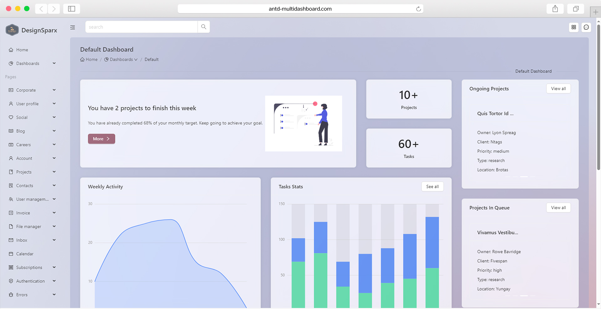

<p align="center">

</p>

<p align="center">
  <a href="https://github.com/design-sparx/antd-mutli-dashboard/blob/master/LICENSE">
    
  </a>
  <a href="https://github.com/design-sparx/antd-mutli-dashboard/issues?q=is%3Aopen+is%3Aissue">
    
  </a>
  <a href="https://github.com/design-sparx/antd-mutli-dashboard/issues?q=is%3Aissue+is%3Aclosed">
    
  </a>
  <a href="https://antd-multipurpose-dashboard.netlify.app/" rel="nofollow">
    </a>
  <a href="https://github.com/design-sparx/antd-multipurpose-dashboard/archive/refs/heads/ft/readme.zip">
    
  </a>
  <a href="https://app.netlify.com/sites/antd-multipurpose-dashboard/deploys">
    
  </a> 
  <a href="https://github.com/design-sparx/antd-multipurpose-dashboard/actions/workflows/chromatic.yml">
    
  </a> 
  <a href="https://github.com/design-sparx/antd-multipurpose-dashboard/actions/workflows/test.yml">
    
  </a>
  <br>
  <a href="https://github.com/design-sparx/antd-mutli-dashboard">
    
  </a>
</p>

- [Live preview](https://antd-multipurpose-dashboard.netlify.app/)
- [Components preview](https://6546507b657a74164abf2db6-oniqlpqtfs.chromatic.com/)

# About

A professional Admin & Dashboard template based on [Ant design 5](https://ant.design/) that comes with hundreds of UI
components, forms, tables, charts, pages and icons. This template is built using [React](https://react.dev/),
[Vite](https://vitejs.dev/), [Ant Design Charts](https://charts.ant.design/) and
[Ant Design Icons](https://ant.design/components/icon).



# Features

- **Customizable:** You don't need to be an expert to customize the template. Our code is very readable and
  well-documented.
- **Fully Responsive:** With mobile, tablet & desktop support it doesn't matter what device you're using. Antd Dashboard
  is responsive in all browsers.
- **Cross-Browser:** Our themes are working perfectly with Chrome, Firefox, Opera, and Edge. We're working hard to
  support them.
- **Clean Code:** We strictly follow Ant Design's guidelines to make your integration as easy as possible. All code is
  handwritten.
- **Regular Updates:** From time to time you'll receive an update containing new components, improvements, and bug
  fixes.

# Quick start

## Download

- Clone this repo git clone `https://github.com/design-sparx/antd-multipurpose-dashboard.git`
- [Download from GitHub](https://github.com/design-sparx/antd-multipurpose-dashboard/archive/refs/heads/main.zip)

## Build tools

You'll need to install Node.js.
Once Node.js is installed, run npm install to install the rest of the template's dependencies. All dependencies will be
downloaded to the node_modules directory.

```bash copy
npm install
```

Now you're ready to modify the source files and generate new files. To automatically detect file changes and start a
local webserver at http://localhost:3000, run the following command.

```bash copy
npm run dev
```

Compile, optimize, minify and uglify all source files to build/

```bash copy
npm run build
```

# File structure

Inside the zip-file you'll find the following directories and files. Both compiled and minified distribution files, as
Inside the zip file, you'll find the following directories and files. Both compiled and minified distribution files, as
well as the source files are included in the package.

```
antd-multi-dashboard/
├── .changeset
├── .github
├── .gitignore
├── eslintrc.cjs
├── README.md
├── CHANGELOG.md
├── CONTRIBUTING.md
├── LICENSE
├── index.html
├── package.json
├── tsconfig.json
├── tsconfig.node.json
├── vite.config.ts
├── yarn.lock
├── public/
│   ├── mocks/
│   ├── _redirects
│   ├── favicon.ico
├── src/
│   ├── assets/
│   ├── components/
│   ├── constants/
│   ├── context/
│   ├── hooks/
│   ├── layouts/
│   ├── pages/
│   ├── routes/
│   ├── types/
│   ├── utils/
│   ├── App.css/
│   ├── App.tsx/
│   ├── index.css/
│   ├── main.tsx/
│   ├── vite-env.d.ts/
└──
```
